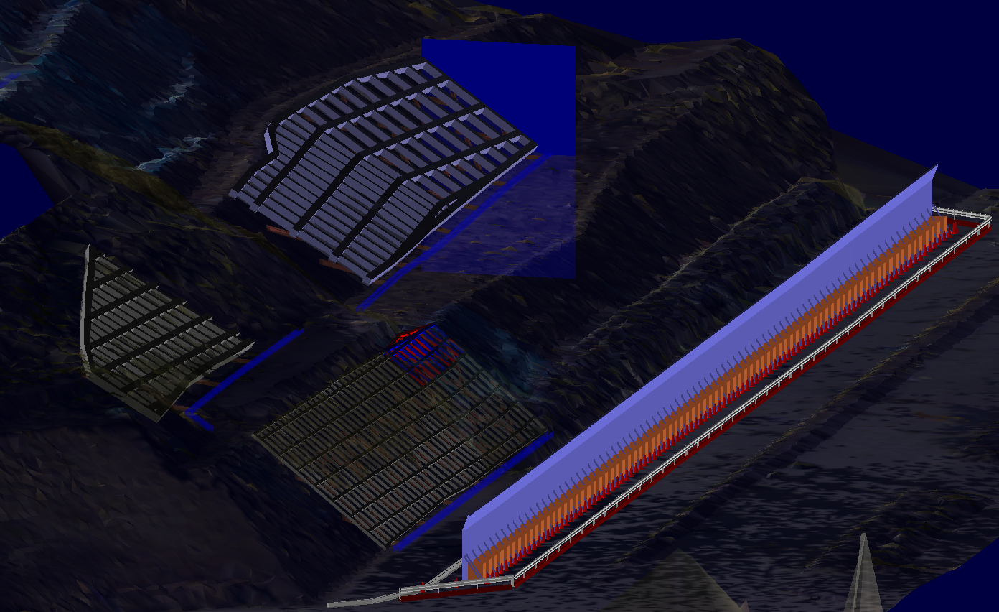

## SiTECH3D studio Modeling

New Project

Hokkaido, Furano

Hokkaido, asahikawa

Hokkaido, asahikawa2

グランドアンカー施工中の交通規制・安全施設を可視化、また狭小する中での安全計画の検討

横断図から地質特性を可視化し、グランドアンカーの根入れ深の妥当性を表示

[video](https://youtu.be/auWd8m4tRhE)

[top](index.md)
