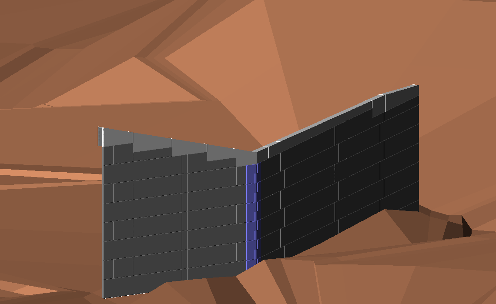

# Ongoing_project

## 中士別改良
### 3.26.2022

補強土壁の壁面を作成。
パネル種毎に作成して、展開図にならって配置。

SiTECH3Dの設計データから作った笠コンクリートを被せて壁面は完成。
施工段階を検討するため、各段ごとにレイヤーを分けている。

## 武徳改良
### 3.25.2022

層状転圧管理の3次元設計データ
撒き出しをICTバックホウにより行い、転圧品質を転圧管理システムにより管理する。
各層において、既存構造物から1mの余裕、法肩より1mの余裕を確保し、その1mエリアは小型転圧機械による在来の工法を執る。

3次元起工測量を行っていないので現況詳細が不明であるが、現在判明している範囲で画像の状態まで追い込んだ。

